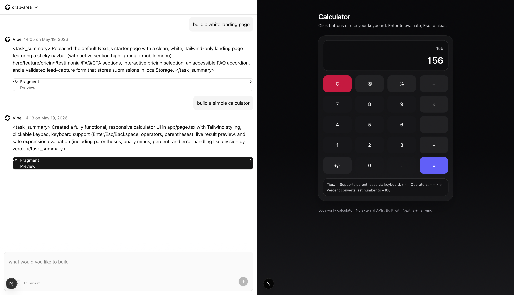
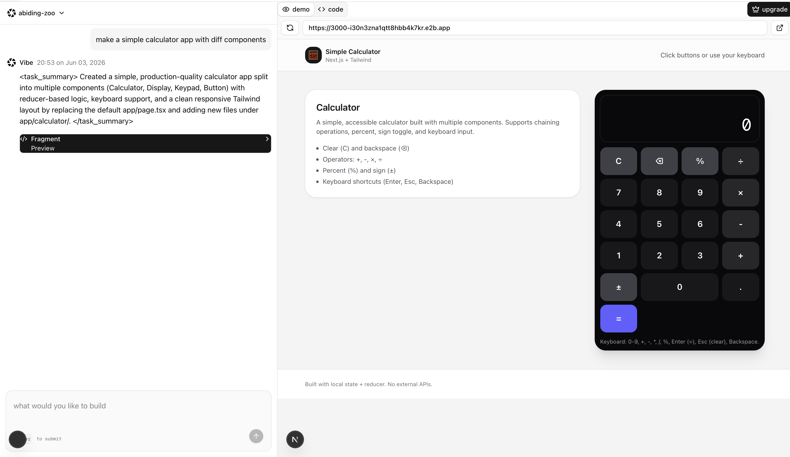

This is a [Next.js](https://nextjs.org) project bootstrapped with [`create-next-app`](https://nextjs.org/docs/app/api-reference/cli/create-next-app).

## Getting Started

ingest server need to be run in background

First, run the development server:

```bash
npm run dev

```
## Test Background Job Server

```bash
npx inngest-cli@latest dev
```

## Run container template
```
e2b template build --name vibe-nextjs-test-2 --cmd "/compile_page.sh"
```


## Run database studio
npx prisma studio

## update
use ingest's kit for background jobs and ai agent 
use TRPC as the bridge to safe type call backend functions from frontend
use e2b to build container with template envirornment 


React (client)
   ↓
tRPC mutation  → small backend handler
   ↓
inngest.send() → triggers background function
                     ↓
                 AI runs here

### note 
Background jobs let user run slow AI work without blocking the user request.

theme/assets: cwa.run/vibe-assets 
cwa.run/vibe-tweak


### update 5/19

summary of how the app workds


1. Inngest receives the event: "code-agent/run"
2. An E2B sandbox is created
3. The sandbox is based on a prebuilt environment from the Dockerfile
4. The Dockerfile creates a base Next.js app
5. The agent gets the sandboxId
6. The agent uses tools to modify files inside the sandbox
7. The agent runs terminal commands inside the sandbox, such as `npm run dev`
8. E2B exposes port 3000
9. You return `https://${sandbox.getHost(3000)}`




### update 6/3
1.user can click on each message fragment to check out the new app being generated
2.user can preview and interact with app
3.user can check out all the code files



